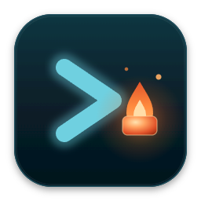
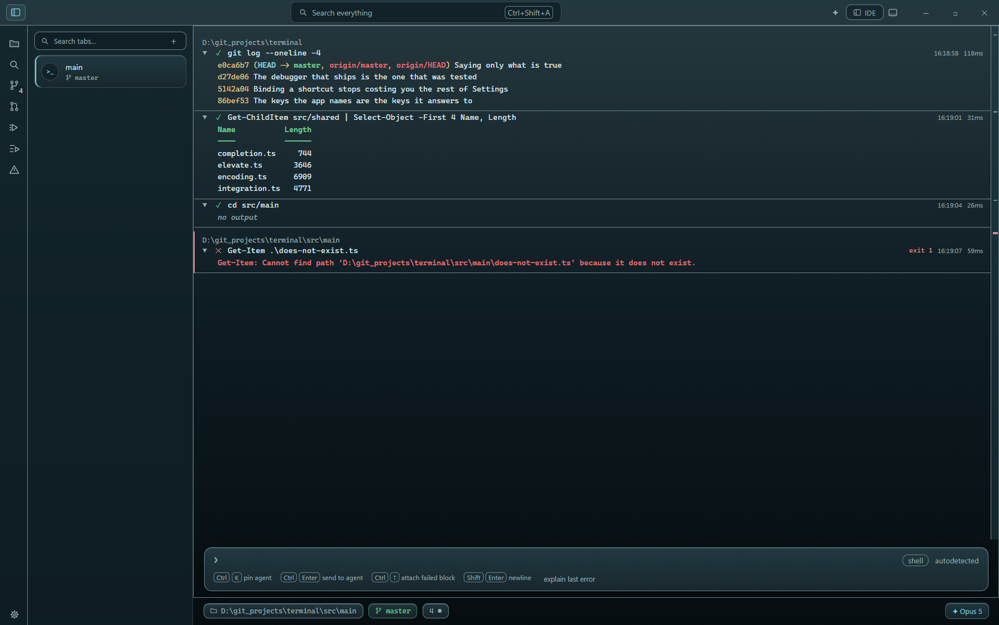
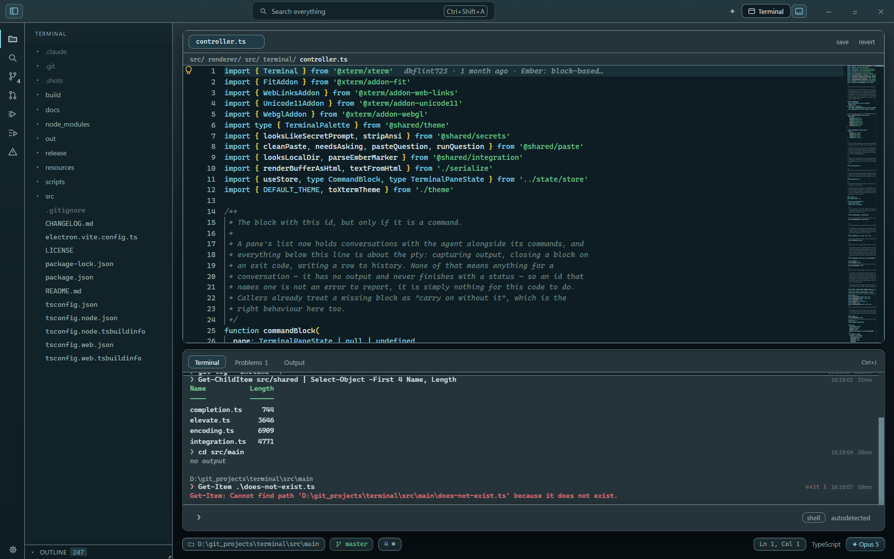

<p align="center">
  
</p>

<h1 align="center">Ember</h1>

<p align="center">
  A fast, block-based terminal for Windows that turns into an IDE on a keystroke —
  with Claude riding along inside it.
</p>



Every command runs as a **block**: a card holding the command, its output, its
exit code and duration. Blocks collapse, copy, re-run, survive restarts, and are
searchable across sessions. Ask a question instead of running a command and the
answer arrives as a block too — the agent lives in the flow of work, not in a
side panel.

Press `Ctrl+Shift+I` and the same window is an IDE: Monaco with real language
servers, a file tree, workspace search, problems, and git — while the terminal
becomes the panel underneath. Nothing restarts and no shell is lost; press it
again and it's a terminal.



## Features

- **Blocks** — collapse, copy command or output, re-run, jump by the overview
  ruler. Restored on launch, bounded in memory and on disk.
- **Shell integration** — PowerShell reports command boundaries, exit codes and
  working directories through OSC 133. cmd, Git Bash and WSL run as plain
  terminals.
- **The agent** — Claude lives in a panel of its own (`Ctrl+Shift+B`): threads
  that stream and remember per session, a Stop that means it, and proposals
  that open as accept/reject diffs or runnable commands. Through your API key
  or the Claude Code CLI; quick asks still answer in the flow.
- **IDE mode** — TypeScript, Python, YAML and PowerShell language servers in
  the box, and any LSP server teachable in settings (rust-analyzer, gopls…);
  go-to definition, snippets, auto-save, format-on-save with the workspace's
  own prettier when it has one, split panes, search and replace.
- **Debugging** — breakpoints in the margin (`F9`, with conditions and
  logpoints), `F5` runs the active file or a `.vscode/launch.json` config,
  attach included; step, pause, restart; exception filters; variables, threads
  and the call stack in the Debug view, values on hover, a console that
  evaluates in the paused frame — and the program runs as a real block in the
  terminal, stdin and all. Node via bundled js-debug (`npm run fetch:js-debug`
  in a dev checkout); any DAP adapter can be taught in settings.
- **Scripts** — the commands a project already declares, listed from its
  `package.json` and one press from running (`Ctrl+Shift+R`). The lockfile
  decides whether that is npm, pnpm, yarn or bun, and each one runs as an
  ordinary block with its exit code and timing.
- **Git** — status, staging, diffs, commits, branch and line counts in the
  status chips; a GitHub panel checks out pull requests via `gh`.
- **History** — every command searchable across sessions (`Ctrl+R`), with
  inline secrets scrubbed before anything is written.
- **Sessions** — the sidebar lists every open shell with its directory and
  branch; the whole window restores on launch, unsaved edits included.
- **Themes** — any VS Code color theme. Drop a `.json` into the themes folder
  (Settings opens it) and it appears in the picker. Ten ship in the box,
  including colour-blind-safe pairs.

## Install

Grab `Ember Setup <version>.exe` from
[Releases](https://github.com/dkflint723/ember-terminal/releases) and run it.

> The installer is not yet code-signed, so SmartScreen will ask whether you
> mean it. Updates are **off by default**; turn them on in Settings, or use
> "Check now" whenever you like — a new version installs when Ember quits,
> never underneath a running shell.

## Keyboard

| Chord | Does |
| --- | --- |
| `Ctrl+Shift+I` | Terminal ↔ IDE |
| `Ctrl+Shift+T` | New session |
| `Ctrl+Shift+N` | New window |
| `Ctrl+Alt+Shift+N` | New window as administrator |
| `Ctrl+Shift+U` | Move session to new window |
| `F5` | Debug: run the active file, or continue |
| `F9` | Debug: toggle breakpoint |
| `F10` / `F11` / `Shift+F11` | Debug: step over / in / out |
| `Shift+F5` | Debug: stop |
| `Ctrl+Tab` | Next session |
| `Ctrl+B` | Side slot — sessions (terminal) or files (IDE) |
| `Ctrl+J` | Panel |
| `Ctrl+Shift+B` | Claude panel |
| `Ctrl+K` | Pin the composer to shell or agent |
| `Ctrl+Enter` | Send the composer's text to the agent |
| `Ctrl+P` / `Ctrl+Shift+P` | Files and sessions / commands |
| `Ctrl+F` | Find in the terminal or editor |
| `Ctrl+R` | Search command history |
| `Ctrl+O` | Open a folder |
| `Ctrl+Shift+F` `G` `H` `M` `R` | Search, source control, GitHub, problems, scripts |
| `Ctrl+Alt+S` | Save all |
| `Alt+Shift+F` | Format document |
| `Ctrl+=` `-` `0` | Zoom |
| `Ctrl+,` | Settings |

## Building it

```bash
npm install
```

```bash
npm run dev
```

```bash
npm run dist
```

`dev` runs with hot reload; `dist` produces the NSIS installer in `release/`.

### Verifying it

The test suite is 57 Playwright scripts under `scripts/verify-*.mjs`, each of
which launches the real app with a throwaway profile and drives it like a hand:

```bash
node scripts/verify.mjs
```

Every suite prints `PASS`/`FAIL` and exits nonzero on failure. They cover the
terminal, blocks, session restore, the editor, LSP, git, themes, keyboard
chords, the status chips, a11y, and the packaged build.

## License

[MIT](LICENSE)
